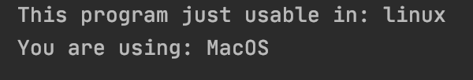
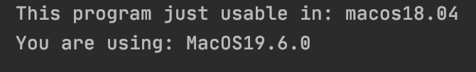

# find-OS
Can you control  which OS  is running easily?  and which you prefer?  just with one code 


## How can we use?
(Example)

### findOS.get()
```python
import findOS

print(findOS.get())

```
>console: MacOS 


```python
import findOS

print(findOS.get(1,1))

```
>console: MacOS19.6.0

### findOS.control("OS")
```python
import findOS

print(findOS.control("macos"))

```
>console: True

```python
import findOS

print(findOS.control("linux"))

```


```python
import findOS

print(findOS.control("macos18.06"))

```


